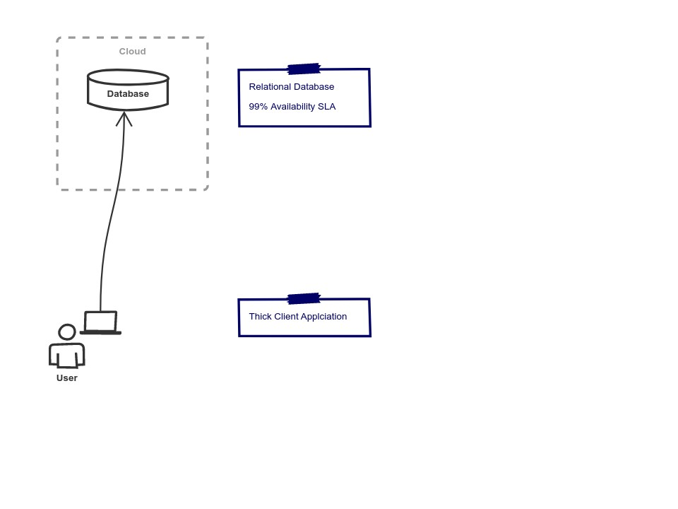

## Understanding high availability in complex systems, and how to calculate them

When working on complex, distributed, multi-tiered systems there are always certain non-functional requirements that the solution should achieve.
Performance and resilience can be a focus of a given sprint team at a component level, but the overall availability of the system as a whole needs a more holistic view.

In this article we scrutinise real-world deployments to understand:

* The relationship between complexity and availability.
* How to work out the theoretical availability of a system.
* How to monitor the actual availability.
* How to achieve 99.99% availability.

---

### The relationship between complexity and availability

The complexity we're referring to here is *not* complexity of the code nor the complexity of the functional solution.
By `complexity` we mean the non-functional complexity that come hand-in-hand with multi-tiered micro-service solutions.

As an end-to-end system becomes more complex, it also becomes, probabilistically, less available.

To understand this better, let's start off with a simple topology and add complexity as we go:

In the example above we have a client-side application installed which connects directly to a cloud hosted database.
The database is hosted in the cloud, and the cloud provider's [SLA](https://en.wikipedia.org/wiki/Service-level_agreement) states an availability of 99%.
Or, to put it another way, it could be unavailable for 1% of the time; which equates to 3.65 days in a year.

If this database is unavailable then our whole system is down. So our system also has an availability of 99%

> An SLA of 99% is awfully low, but we're keeping this example simple and rounding up to whole numbers.

There are very good reasons why don't design [thick-client](https://en.wikipedia.org/w/index.php?title=Thick_client&redirect=yes) applications anymore, so let's make this a little more realistic by changing it to be browser based.
