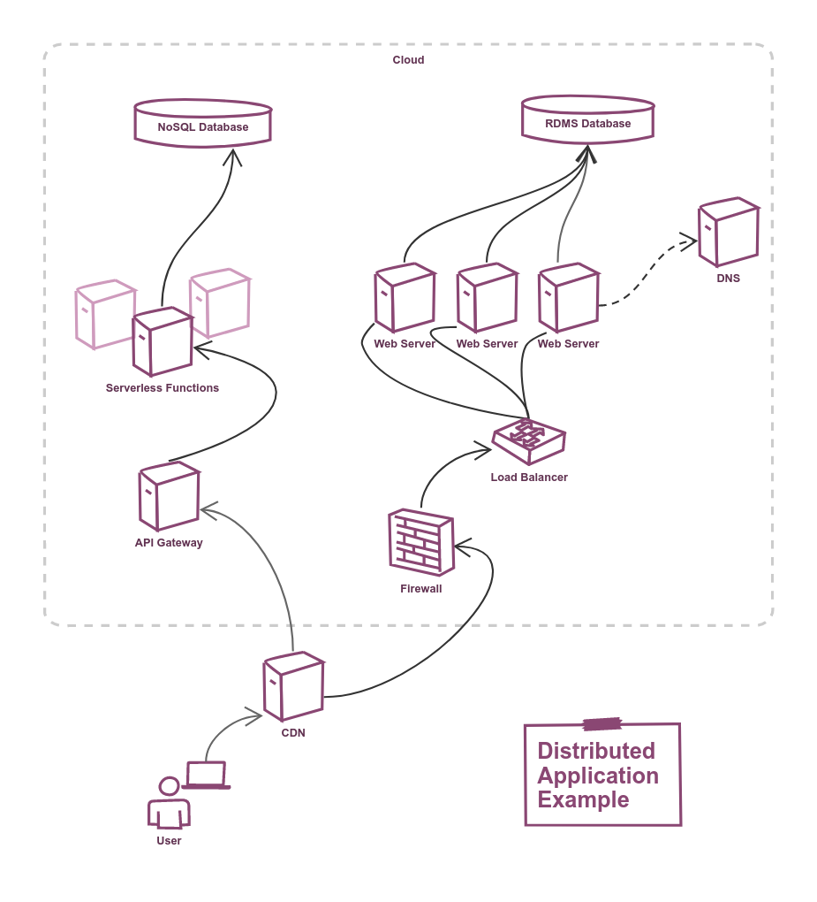
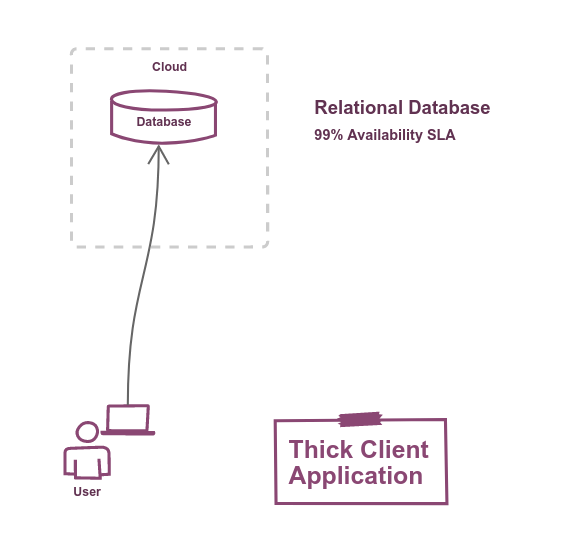
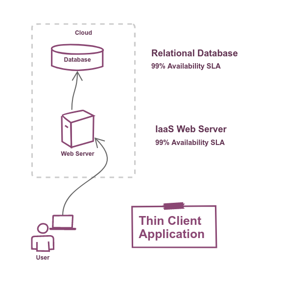

import Tabs from '@theme/Tabs';
import TabItem from '@theme/TabItem';

## Complexity in multi-tiered systems

Modern cloud-native solutions invariably employ micro-service architecture, resulting in highly distributed applications spanning multiple tiers.

The benefits of this approach are well documented and not in dispute, but it does add a certain complexity.

The complexity we're referring to here is *not* complexity of the code, nor complexity of the functionality of the solution; By **complexity** we mean the non-functional complexity that come hand-in-hand with multi-tiered micro-service solutions. As an end-to-end system becomes more complex, it also becomes, probabilistically, less available.

Consider the example topology below, and that each of these nine tiers will be underpinned by a given cloud service, and the service provider will publish it's availability [SLA](https://en.wikipedia.org/wiki/Service-level_agreement) for each of those services; but when *our* end users expect an SLA statement about the guaranteed availability of *our* overall service, **How do we calculate the availability SLA of a distributed system?**

[](./img/High_Availability_Example.png)

To work this out for any conceivable topology, we must first understand the **The relationship between complexity and availability**

---

## The Relationship Between Complexity and Availability

To understand this better, let's start off with a simple topology and add complexity as we go:

### Single tier

[](./img/High_Availability_Simple_Topology.png)

In the example above we have a client-side application which connects directly to a cloud hosted database, and the cloud provider's SLA states an availability of 99%.

If the database is down, then our whole system is down. So our system also, inherently, has an availability of **99%**

:::caution
There are very good reasons why don't design [thick-client](https://en.wikipedia.org/w/index.php?title=Thick_client&redirect=yes) applications anymore.

This example serves only as a baseline upon which to add complexity and examine how the system's availability evolves.
:::

Let's make our system a little more realistic by changing it to be a browser based application and see how it changes our system's 99% Availability.

---

### Two tiers

If we add a web server between the client and the database we're introducing a new tier into our system.

[](./img/High_Availability_Web_app.png)

The client's browser uses `HTTPS` to communicate with the web server, and the application hosted on the web server connects to the database.

> For simplicity we're stating that the web server's availability is also 99%.

If either of these two tiers are down, then our system is down (because each tier is useless by itself).

#### Calculating Probability

So we now have two tiers, each with 0.99 probability of being available at any given point time.

:::info

Probabilities are expressed as numbers between **zero** (no chance of happening) and **one** (a certainty).

:::

Calculating our system's availability is a simple matter of multiplying each tier's probability of being available (being up).

```text
0.99 * 0.99 = 0.98
```

So our revised system architecture has an availability **98%**. Notice that this is *lower* than the previous, more simplistic, example. If this is surprising to you. it can rationalised by considering that we'd expect the database to be down 1% of the time, but we'd also expect the web server to be down 1% of the time. These two separate downtimes combine for a total of 2% downtime.

:::tip

The addition of additional tiers into a distributed application decreases it's expected availability.

:::

---

### Real World Example

Let's return to our earlier example of a topology with nine tiers:

   * Relational database
   * NoSQL database
   * DNS
   * Serverless compute
   * Web Servers
   * API Gateway
   * Load Balancer
   * Firewall
   * CDN

[](./img/High_Availability_Example.png)

Using our cloud service provider's SLA documentation, such as [Azure's](https://azure.microsoft.com/en-us/support/legal/sla/summary/) or [AWS's](https://aws.amazon.com/legal/service-level-agreements/), we can find the Service Availability for each of our tiers and multiply them together to obtain our solution's availability.

<Tabs>
  <TabItem value="azure" label="Azure" default>
      Azure Availability SLAs

      | Tier                | Azure Service              | Service Availability |
      |---------------------|----------------------------|----------------------|
      | Relational database | Azure SQL Database         |        99.99%        |
      | NoSQL database      | Azure CosmosDB             |        99.99%        |
      | DNS                 | Azure Provided DNS         |       100.00%        |
      | Serverless compute  | Azure Functions            |        99.95%        |
      | Web Servers         | Azure Cloud Services       |        99.95%        |
      | API Gateway         | Azure API Management       |        99.95%        |
      | Load Balancer       | Azure Load Balancer        |        99.99%        |
      | Firewall            | Azure Firewall             |        99.95%        |
      | CDN                 | Azure CDN                  |        99.90%        |

      0.9999 * 0.9999 * 1.0000 * 0.9995 * 0.9995 * 0.9995 * 0.9999 * 0.9995 * 0.999 = 0.9967

      End-to-end System's Availability SLA is 99.67%
-  </TabItem>
  <TabItem value="aws" label="AWS">
      AWS Availability SLAs

      | Tier                | AWS Service                | Service Availability |
      |---------------------|----------------------------|----------------------|
      | Relational database | Amazon RDS                 |        99.95%        |
      | NoSQL database      | AWS DynamoDB               |        99.99%        |
      | DNS                 | Amazon Route 53            |        99.99%        |
      | Serverless compute  | AWS Lambda                 |        99.95%        |
      | Web Servers         | Amazon Lightsail (managed) |        99.95%        |
      | API Gateway         | AWS API Gateway            |        99.95%        |
      | Load Balancer       | Elastic Load Balancer      |        99.99%        |
      | Firewall            | AWS Network Firewall       |        99.90%        |
      | CDN                 | Amazon CloudFront          |        99.90%        |

      0.9995 * 0.9999 * 0.9999 * 0.9995 * 0.9995 * 0.9995 * 0.9999 * 0.9990 * 0.9990 = 0.9957

      End-to-end System's Availability SLA is 99.57%
  </TabItem>
</Tabs>

It's interesting to note the slight differences between providers. In this example, Azure offers a 0.1% higher availability SLA than AWS for these equivalent services, but there are caveats:

* Many services have multiple tiers, and different tiers offer different availability SLAs. For this example I've used the highest tier on offer, but ...
* These services change and improve over time, so this example is just snapshot in time rather than evidence of superiority.
* Service providers may not achieve their SLAs, and conversely may exceed them.
* Different regions *will* have different uptime results. e.g. AWS's `us-east-1` region *usually* gets updates first, so you might expect solutions deployed there to be effected more by problematic updates.
* In my experience, downtime normally results from problems with deployments of the solution, or escaped bugs, rather than the underlying cloud platform. So the lesson there is to avoid shooting yourself in the foot by having a like-live non-production environment and a robust QA process.

## Conclusion

If you're going to offer your user-base an **Availability SLA**, then this methodology will allow you to calculate the composite availability for your solution. The key points are:

* Identify each critical tier in your solution and the service that hosts them.
* Our example is constrained to services offered be a single cloud provider, but you might have additional third party services to include too (CDN, oAuth provider, back-end SaaS service, etc).
* Obtain the provider's availability SLA for each of these tiers/services as a value between zero and one (i.e. 0.995 = 99.5%).
* Multiply all of these values together to obtain your solution's SLA.
* Keep in mind that this figure represents the *highest* SLA you should offer for your solution because:
  * For your solution to exceed this uptime objective you'll need your service providers to exceed their's, and you can't guarantee that.
  * There are other variables that can effect availability that aren't accounted for, such as failed deployments, bugs, misconfigurations, etc.
  * In other words, if you achieve a higher uptime it'll be by luck rather than by design, so don't quote anything higher.
