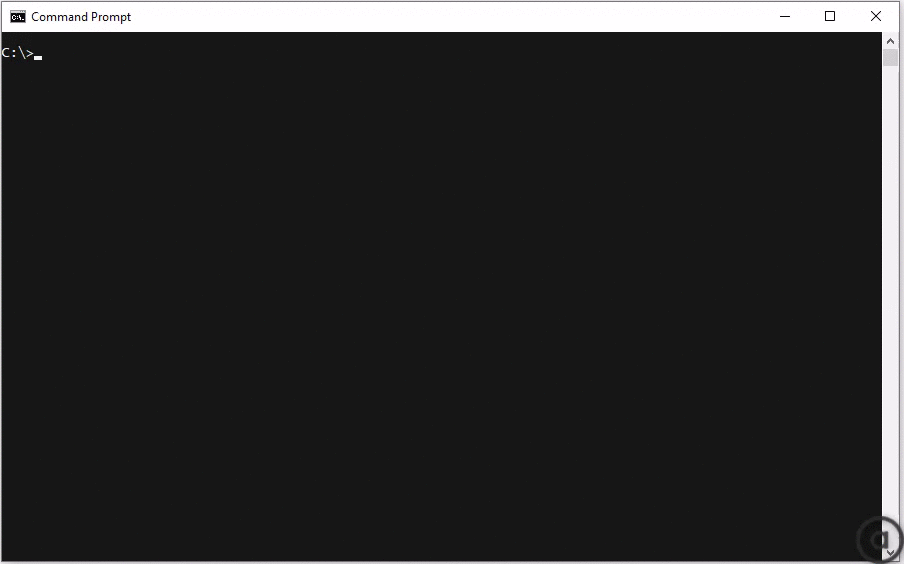

# akamai-error-lookup


[akamai-error-lookup](https://github.com/MarkSMurphy/akamai-error-lookup#readme) is a command line utility which looks up an Akamai error reference (the 'hash reference' number) and translates it into details about what caused that error.

## Installation

```bash
npm install akamai-error-lookup --location=global
```

## Usage

```bash
hashref errorReference [options]
```



## Options

```text
   errorReference                   The Akamai Error Reference number to lookup
   --decode <true|false>            Enable or disable decoding of URLs and user-agent [true]
   --no-color                       Switches off colour output
   --version                        Display version number
   --help                           Display this help
```

---
