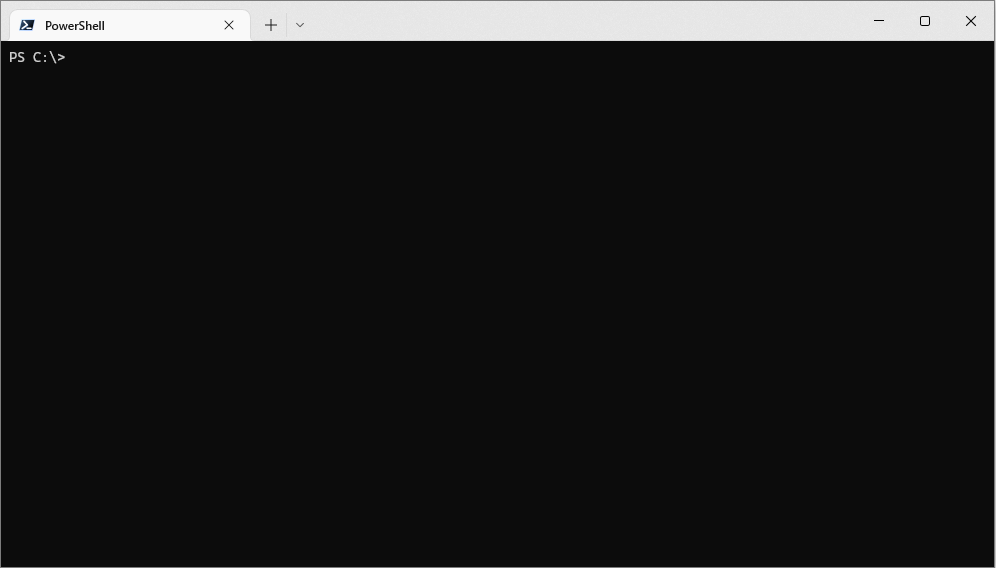

# akamai-staging


[akamai-staging](https://github.com/MarkSMurphy/akamai-staging#readme) is a command line utility to provide an Akamai Staging Network IP address for one or more domains.

## Installation

```bash
npm install akamai-staging --location=global
```

## Usage

```bash
staging domain [domain [domain] ...]
```



## Options

```text
   domain [domain [domain] ...]     Lookup Staging IP address for one or more domains
   --info                           Display platform specific DNS information
   --version                        Display version number
   --help                           Display this help
```

---
