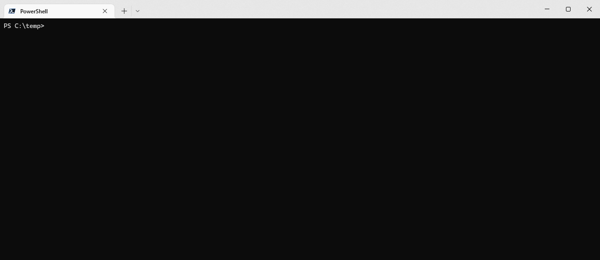

# cdn-cache-check


[cdn-cache-check](https://github.com/MarkSMurphy/cdn-cache-check#readme) is a command line utility which helps to analyse URLs to determine if they're served via a CDN and the caching behaviours of both the CDN and the user-agent.

## Installation

```bash
npm install cdn-cache-check --location=global
```

## Usage

```bash
ccc [<url> | <filename> [<url> | <filename>] […] ] [options]
```



## Options

```text
   <url>                         A URL to query
   <filename>                    Specify a file containing a list of URLs to query
   --method <head|get|options>   Specify the HTTP method.  Default: GET
   --headers <collection>        Select which collection of headers to output.
   --list-header-collections     List all Header Collections and the response headers they contain
   --list-response-headers       List all unique response headers. Useful when creating a new header collection.
   --export <true|false>         Exports output to a .csv file.  Default: true
   --open                        Opens the exported .csv file automatically.
   --follow <integer>            The number of HTTP redirects to follow. Default: 5
   --debug                       Enables verbose debugging output
   --no-color                    Switches off colour output
   --version                     Display version number
   --help                        Display this help
```

---
