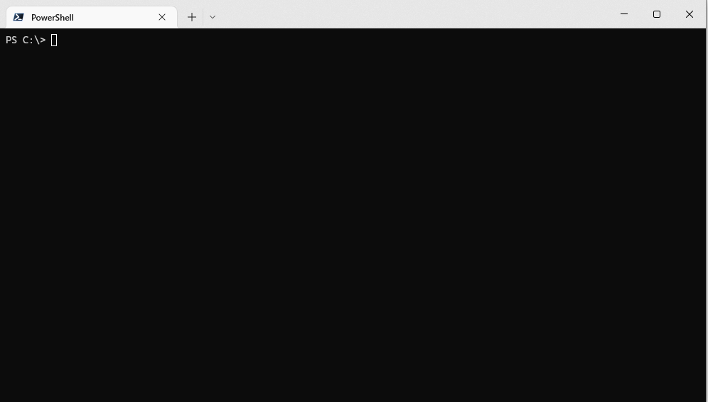

# codename-generator


Have you ever needed to give something a code name? Perhaps for a project you're working on, or a new screen-name, but your imagination has let you down? Use [codename-generator](https://github.com/MarkSMurphy/codename-generator#readme) to suggest some random code names.

It has a small dictionary of a few thousand inoffensive adjectives and nouns which are picked at random to generate a suggested code name. By default a screen-full of suggestions are made, so the larger your screen is, the more suggestions you'll have.

## Installation

```bash
npm install -g codename-generator
```

## Usage

```bash
codename-generator [options]
```



## Options

```text
   <number>                         Generate <number> code names
   --list-adjectives                Lists all adjectives in the dictionary
   --list-nouns                     Lists all nouns in the dictionary
   --nsfw                           "Not Safe for Work" mode outputs profanities
   --no-color                       Switches off colour output
   --version                        Display version number
   --help                           Display this help
```

---
