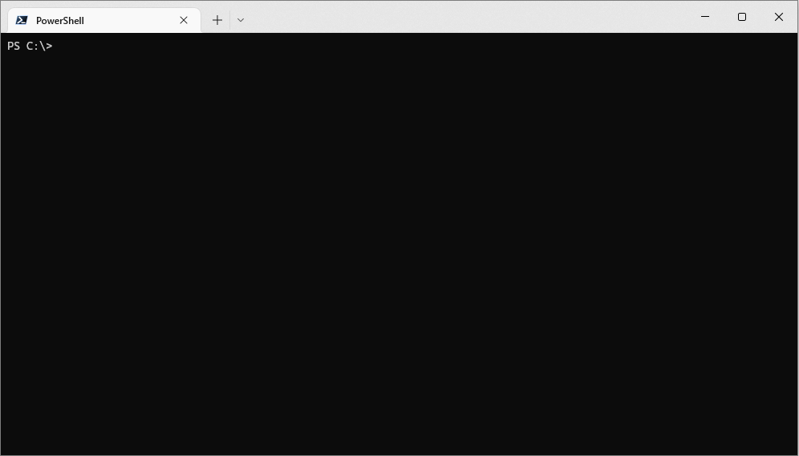

# distributed-dig


[distributed-dig](https://github.com/MarkSMurphy/distributed-dig#readme) is a command line utility which makes DNS lookup requests across multiple, geographically dispersed, DNS resolvers and collates the results.

Useful for checking if a DNS record has been fully propagated, or for querying the origins behind an `AWS Route 53` / `Azure Traffic Manager` DNS record (or any other DNS-based load balancing solution).

## Installation

```bash
npm install distributed-dig --location=global
```

## Usage

```bash
ddig domain [domain [domain] ...] [options]
```



## Options

```text
   domain [domain [domain] ...]     Perform DNS lookups on one or more domains
   --port <number>                  Specify the DNS port [53]
   --protocol <upd|tcp>             Specify the DNS protocol [udp]
   --timeout <number>               Specify the DNS timeout in milliseconds [2500]
   --edns <true|false>              Enable or disable EDNS(0) [false]
   --config <filename>              Specify an alternative configuration file
   --unique                         Filter out duplicate IP addresses
   --list-resolvers                 List resolvers configured in config file
   --list-options                   List DNS request options configured in config file
   --list-defaults                  Print json of default config file settings
   --verbose                        Outputs more information
   --no-color                       Switches off colour output
   --version                        Display version number
   --help                           Display this help
```

---
