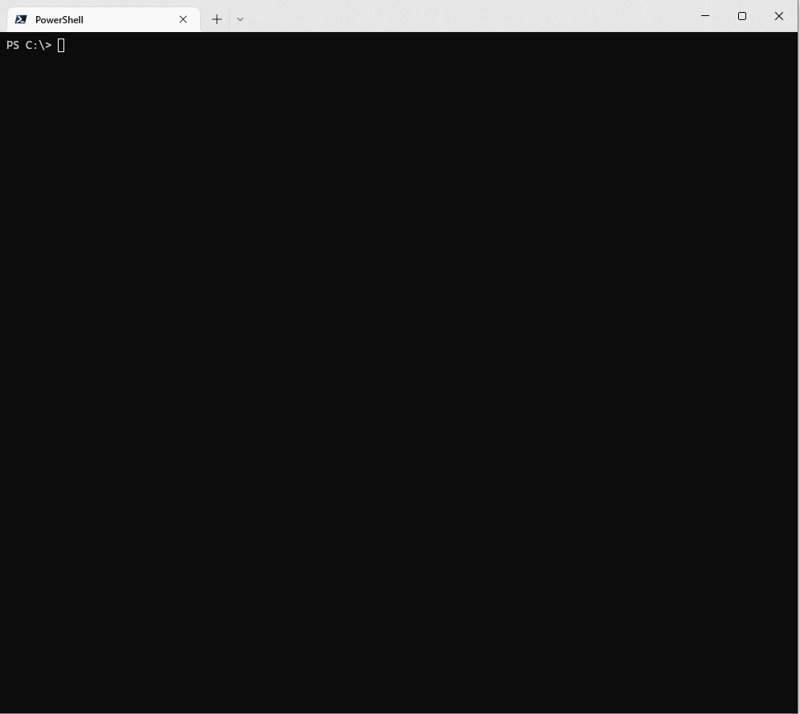

# fantasy-f1-analyzer


[fantasy-f1-analyzer](https://github.com/MarkSMurphy/fantasy-f1-analyzer#readme) is a utility which retrieves the latest Fantasy F1 results and analyses all possible constructor and driver combinations before suggesting an optimum Fantasy F1 Team.

## Installation

```bash
npm install fantasy-f1-analyzer --location=global
```

## Usage

```bash
ff1 [options]
```



## Options

```text
   --export <filename>           Exports the results to the specified filename
   --year <nnnn>                 Override the default season. Default: 2022
   --budget <nnn>                Override the default budget cap. Default: 100
   --worst                       Displays the team with the worst points tally instead of the best
   --progressinterval <n>        Update analysis progress every nth team. Default: 5
   --verbose                     Enables verbose output.
   --debug                       Enables debugging output.
   --no-color                    Switches off colour output.
   --version                     Display version number.
   --help                        Display help screen.
```

---
