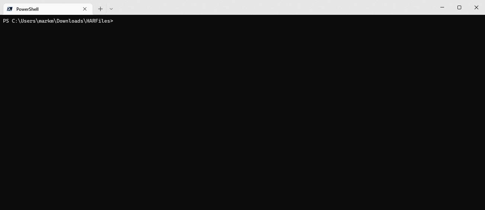

# shrink-har


[shrink-har](https://github.com/MarkSMurphy/shrink-har#readme) is a command line utility that reduces the size of saved [HTTP Archive](https://en.wikipedia.org/wiki/HAR_(file_format)) files by removing the response body.

> *Caution* This tool is destructive. If you're using HAR files to debug API responses, or any other payload, then this tool isn't for you. It is *only* useful if your debugging needs are limited to HTTP request/response headers thereby rendering the response bodies superfluous.

## Overview

HTTP Archive files can be large when they contain multiple response bodies. I wrote this tool when I needed to retain dozens of HAR files but was only interested in HTTP headers. The response bodies (images, CSS, Javascript, API JSON, etc) were superfluous to my needs but were the majority of the file sizes.

Shrink-HAR will:

* Analyse HAR files and report on potential savings.
* Optionally backup existing HAR files to a ZIP file before shrinking them.
* Shrink `HAR` files by stripping them, permanently, of all the response bodies.

## Installation

```bash
npm install -g shrink-har
```

## Usage

```bash
shrink-har [options]
```



## Options

```text
   --file <filespec>             File specification. Default: *.har
   --directory <path>            Specify the directory.  Default: .
   --commit                      Commit changes to files. If absent only analysis is performed
   --yes, -y                     Automatically answer "yes" to confirmation prompts
   --backup                      Backup files before making changes. Default: false
   --verbose                     Enables verbose output
   --debug                       Enables debugging output
   --no-color                    Switches off colour output
   --version                     Display version number
   --help                        Display this help
```

---
